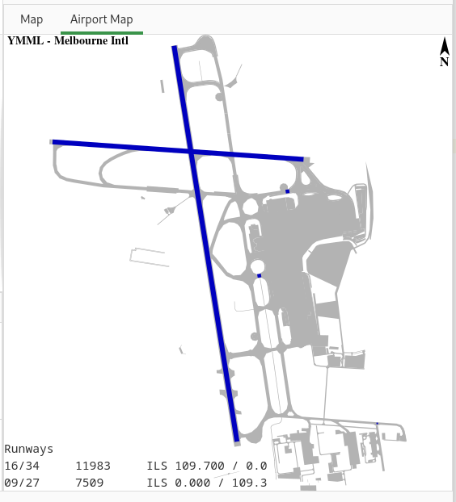

Airport layouts
===============

 The airport map view shows the layout of the selected airport.
  |Airport screenshot|

Use the context menu of the plan or airport search views to display the layout of an airport
`plan <plan_editor.html>`__ or
`airport search <airport_view.html>`__

Only one airport can be viewed at
a time.

