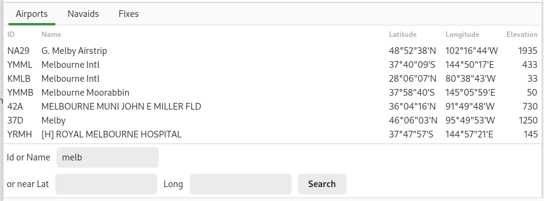

Airport Search
==============

The airport search view is used  to find airports you want to add  to the plan.  |Airport search screenshot|  The panel has a list of airports  that meet the search criteria.  The table will be initially  empty.

.. You can click on the  column headings in the table to  sort the table by that
.. column.  Clicking a second time will  reverse the sort order.

Use the search criteria to select  the airports to be shown in the  list.  The criteria are:

-  Airport ID or partial name.
   If an Airport Id matches or the name contains the entered value it will be selected.
-  Location Near.
   Enter the position, latitude and longitude, you wish and the Airports can be to be selected.

If you enter both a Name and a Location, both criteria must be satisfied for an Airport to be selected.
When you have entered the criteria press the search button or press enter.

Double click on the desired airport to add it to the plan.

Plan context menu
-----------------
 |Airport popover|

Use the plan context menu to add an airport to the plan and to view and find items of interest.

.. |Airport popover| image:: images/AirportPopover.png
